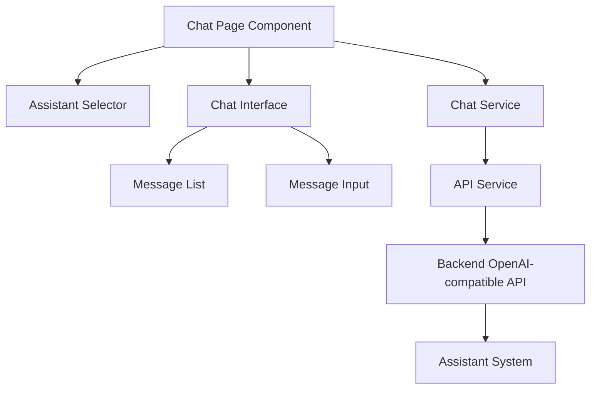

# Design Document: Assistant Chat Interface

## Overview

The Assistant Chat Interface will provide a modern, user-friendly web interface for interacting with AI assistants through the OpenAI-compatible API. The interface will be implemented as a new page in the existing React frontend application, following the established design patterns and utilizing the existing API services.

The chat interface will support real-time streaming responses, session management, and message formatting, providing users with an intuitive way to interact with different assistants without needing to write code or make direct API calls.

## Architecture

The Assistant Chat Interface will follow the existing frontend architecture pattern:

1. **React Components**: UI components for the chat interface, message display, and assistant selection
2. **TypeScript Types**: Type definitions for chat messages, sessions, and API responses
3. **API Services**: Service layer for communicating with the backend API
4. **State Management**: Local state and React Query for remote state management

The feature will integrate with the existing authentication system and leverage the OpenAI-compatible API endpoints already implemented in the backend.



## Components and Interfaces

### 1. ChatPage Component

The main page component that orchestrates the chat experience:

```typescript
interface ChatPageProps {
  // No specific props needed
}

const ChatPage: React.FC<ChatPageProps> = () => {
  // State for selected assistant, messages, etc.
  // Handlers for sending messages, changing assistants, etc.
  
  return (
    <div className="chat-page">
      <AssistantSelector 
        onSelectAssistant={handleSelectAssistant} 
        selectedAssistantId={selectedAssistantId} 
      />
      <ChatInterface 
        messages={messages}
        onSendMessage={handleSendMessage}
        isLoading={isLoading}
        streamingMessage={streamingMessage}
      />
    </div>
  );
};
```

### 2. AssistantSelector Component

Allows users to select which assistant to chat with:

```typescript
interface AssistantSelectorProps {
  onSelectAssistant: (assistantId: string) => void;
  selectedAssistantId?: string;
}

const AssistantSelector: React.FC<AssistantSelectorProps> = ({
  onSelectAssistant,
  selectedAssistantId
}) => {
  // Fetch available assistants
  // Handle selection
  
  return (
    <Select 
      options={assistantOptions}
      value={selectedAssistantId}
      onChange={onSelectAssistant}
      placeholder="Select an assistant"
    />
  );
};
```

### 3. ChatInterface Component

The main chat interface containing message history and input:

```typescript
interface ChatInterfaceProps {
  messages: ChatMessage[];
  onSendMessage: (content: string) => void;
  isLoading: boolean;
  streamingMessage?: string;
}

const ChatInterface: React.FC<ChatInterfaceProps> = ({
  messages,
  onSendMessage,
  isLoading,
  streamingMessage
}) => {
  return (
    <div className="chat-interface">
      <MessageList 
        messages={messages} 
        streamingMessage={streamingMessage}
      />
      <MessageInput 
        onSendMessage={onSendMessage}
        isLoading={isLoading}
      />
    </div>
  );
};
```

### 4. MessageList Component

Displays the conversation history:

```typescript
interface MessageListProps {
  messages: ChatMessage[];
  streamingMessage?: string;
}

const MessageList: React.FC<MessageListProps> = ({
  messages,
  streamingMessage
}) => {
  // Logic for scrolling to bottom, etc.
  
  return (
    <div className="message-list">
      {messages.map(message => (
        <MessageBubble 
          key={message.id}
          message={message}
        />
      ))}
      
      {streamingMessage && (
        <MessageBubble 
          message={{
            id: 'streaming',
            role: 'assistant',
            content: streamingMessage,
            isStreaming: true
          }}
        />
      )}
    </div>
  );
};
```

### 5. MessageBubble Component

Renders individual messages with appropriate styling:

```typescript
interface MessageBubbleProps {
  message: ChatMessage;
}

const MessageBubble: React.FC<MessageBubbleProps> = ({ message }) => {
  const isUser = message.role === 'user';
  
  return (
    <div className={`message-bubble ${isUser ? 'user' : 'assistant'}`}>
      <div className="message-header">
        <span className="message-role">{message.role}</span>
        {message.timestamp && (
          <span className="message-time">
            {formatTime(message.timestamp)}
          </span>
        )}
      </div>
      <div className="message-content">
        <ReactMarkdown>{message.content}</ReactMarkdown>
      </div>
    </div>
  );
};
```

### 6. MessageInput Component

Allows users to type and send messages:

```typescript
interface MessageInputProps {
  onSendMessage: (content: string) => void;
  isLoading: boolean;
}

const MessageInput: React.FC<MessageInputProps> = ({
  onSendMessage,
  isLoading
}) => {
  const [message, setMessage] = useState('');
  
  const handleSubmit = (e: React.FormEvent) => {
    e.preventDefault();
    if (message.trim() && !isLoading) {
      onSendMessage(message);
      setMessage('');
    }
  };
  
  return (
    <form className="message-input" onSubmit={handleSubmit}>
      <Input.TextArea
        value={message}
        onChange={e => setMessage(e.target.value)}
        placeholder="Type your message..."
        autoSize={{ minRows: 1, maxRows: 6 }}
        disabled={isLoading}
      />
      <Button 
        type="primary" 
        htmlType="submit"
        loading={isLoading}
        icon={<SendOutlined />}
      />
    </form>
  );
};
```

## Data Models

### ChatMessage Type

```typescript
interface ChatMessage {
  id: string;
  role: 'user' | 'assistant' | 'system';
  content: string;
  timestamp: string;
  isStreaming?: boolean;
}
```

### ChatSession Type

```typescript
interface ChatSession {
  id: string;
  assistantId: string;
  assistantName: string;
  messages: ChatMessage[];
  createdAt: string;
  updatedAt: string;
}
```

### ChatCompletionRequest Type

```typescript
interface ChatCompletionRequest {
  model: string; // Assistant name
  messages: {
    role: string;
    content: string;
  }[];
  stream: boolean;
  temperature?: number;
  max_tokens?: number;
  session_id?: string;
}
```

## API Integration

### ChatService

A new service will be created to handle chat-specific API calls:

```typescript
class ChatService {
  // Send a message to the assistant and get a response
  static async sendMessage(
    assistantName: string,
    messages: { role: string; content: string }[],
    sessionId?: string
  ): Promise<ApiResponse<ChatCompletionResponse>> {
    return apiService.post('/chat/completions', {
      model: assistantName,
      messages,
      stream: false,
      session_id: sessionId
    });
  }
  
  // Stream a response from the assistant
  static streamMessage(
    assistantName: string,
    messages: { role: string; content: string }[],
    sessionId?: string,
    onChunk: (chunk: string) => void,
    onDone: () => void,
    onError: (error: any) => void
  ): () => void {
    const controller = new AbortController();
    const { signal } = controller;
    
    const fetchStream = async () => {
      try {
        const response = await fetch(`${API_BASE_URL}/chat/completions`, {
          method: 'POST',
          headers: {
            'Content-Type': 'application/json',
            'Authorization': `Bearer ${apiService.getApiKey()}`
          },
          body: JSON.stringify({
            model: assistantName,
            messages,
            stream: true,
            session_id: sessionId
          }),
          signal
        });
        
        if (!response.ok) {
          throw new Error(`HTTP error! status: ${response.status}`);
        }
        
        const reader = response.body?.getReader();
        if (!reader) throw new Error('Response body is null');
        
        const decoder = new TextDecoder();
        let buffer = '';
        
        while (true) {
          const { done, value } = await reader.read();
          if (done) break;
          
          buffer += decoder.decode(value, { stream: true });
          
          const lines = buffer.split('\n');
          buffer = lines.pop() || '';
          
          for (const line of lines) {
            if (line.startsWith('data: ')) {
              const data = line.slice(6);
              if (data === '[DONE]') {
                onDone();
                return;
              }
              
              try {
                const parsed = JSON.parse(data);
                if (parsed.choices?.[0]?.delta?.content) {
                  onChunk(parsed.choices[0].delta.content);
                }
              } catch (e) {
                console.error('Error parsing SSE data', e);
              }
            }
          }
        }
        
        onDone();
      } catch (error) {
        if (error.name !== 'AbortError') {
          onError(error);
        }
      }
    };
    
    fetchStream();
    
    // Return abort function
    return () => controller.abort();
  }
}
```

## Error Handling

The chat interface will implement comprehensive error handling:

1. **Network Errors**: Display appropriate error messages when API calls fail
2. **Authentication Errors**: Redirect to login page if API key is invalid
3. **Streaming Errors**: Gracefully handle interruptions in streaming responses
4. **Rate Limiting**: Display friendly messages when rate limits are hit
5. **Assistant Unavailability**: Show error if selected assistant is unavailable

Error messages will be displayed as inline alerts in the chat interface, with options to retry when appropriate.

## Testing Strategy

### Unit Tests

1. Test individual components with mocked data
2. Verify component rendering and state changes
3. Test utility functions for message formatting

### Integration Tests

1. Test the interaction between components
2. Verify API service integration with mocked responses
3. Test streaming functionality with simulated SSE responses

### End-to-End Tests

1. Test the complete chat flow from assistant selection to response
2. Verify session persistence across page reloads
3. Test error handling scenarios

## User Experience Considerations

1. **Responsive Design**: The chat interface will be fully responsive, working well on desktop and mobile devices
2. **Accessibility**: All components will follow accessibility best practices (ARIA attributes, keyboard navigation)
3. **Loading States**: Clear loading indicators for all async operations
4. **Error Feedback**: User-friendly error messages with recovery options
5. **Markdown Support**: Proper rendering of markdown in assistant responses
6. **Code Highlighting**: Syntax highlighting for code blocks in responses
7. **Auto-scroll**: Automatically scroll to the latest message
8. **Session Persistence**: Maintain chat history across page reloads