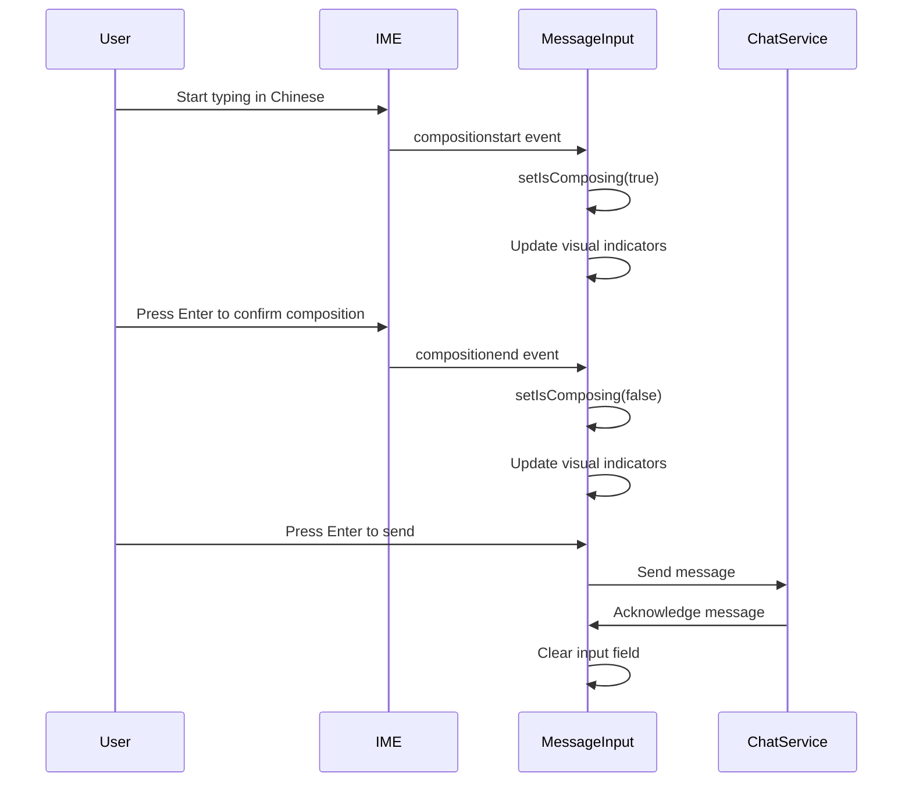
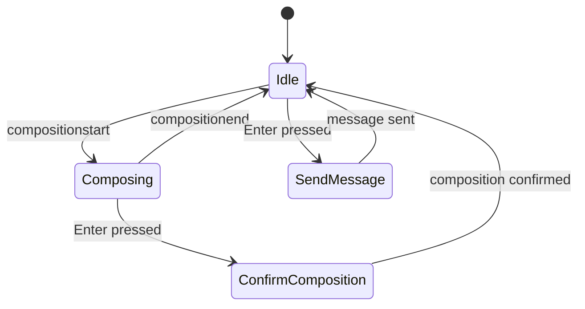

# Design Document: Chinese Input Method Handling

## Overview

This design document outlines the approach for improving the chat input experience for users of Chinese and other IME-based input methods. The current implementation treats all Enter key presses the same way, which causes issues when users are in IME composition mode. The new design will detect IME composition state and adjust the Enter key behavior accordingly.

## Architecture

The solution will build upon the existing `MessageInput` component by adding IME composition state detection and handling. We'll use React's event system to detect IME-specific events and maintain composition state.

### Key Components

1. **MessageInput Component**: The existing component will be enhanced to handle IME composition states.
2. **IME State Management**: New state variables will track whether the user is currently in IME composition mode.
3. **Visual Feedback System**: UI elements to indicate the current input mode and expected Enter key behavior.

## Components and Interfaces

### Enhanced MessageInput Component

```typescript
interface MessageInputProps {
  onSendMessage: (message: string) => void;
  isLoading: boolean;
  disabled?: boolean;
}

interface MessageInputState {
  message: string;
  isComposing: boolean; // New state to track IME composition
}
```

### IME Event Handling

The component will implement the following event handlers:

1. **onCompositionStart**: Triggered when IME composition begins
2. **onCompositionEnd**: Triggered when IME composition ends
3. **onCompositionUpdate**: (Optional) Triggered during IME composition updates

These events are standard DOM events that are fired during IME input processes.

### Visual Feedback Components

1. **Input Mode Indicator**: A small indicator showing whether Enter will send or confirm composition
2. **Tooltip/Hint**: Contextual help text that changes based on input mode
3. **Send Button State**: Visual changes to the send button based on composition state

## Data Models

No new data models are required for this feature. We will use React component state to track the IME composition state.

```typescript
// Component state
const [isComposing, setIsComposing] = useState(false);
```

## Error Handling

1. **Browser Compatibility**: Handle differences in IME event implementation across browsers
2. **Event Sequence Errors**: Handle cases where composition events might fire in unexpected orders
3. **Fallback Behavior**: If composition detection fails, provide alternative ways to send messages

## Testing Strategy

### Unit Tests

1. Test IME composition state changes
2. Test Enter key behavior in different states
3. Test visual feedback components

### Integration Tests

1. Test the complete message input flow with simulated IME events
2. Test interaction between composition state and message sending

### Manual Testing

1. Test with actual Chinese input methods on different platforms
2. Test with other IME-based input methods (Japanese, Korean, etc.)
3. Cross-browser testing focusing on Chrome, Firefox, Safari, and Edge

## Technical Decisions

### IME Detection Approach

We will use the standard DOM composition events (`compositionstart`, `compositionend`, `compositionupdate`) to detect IME state. These events are well-supported across modern browsers and provide reliable information about IME composition state.

**Rationale**: This approach is more reliable than trying to detect IME by keyboard events or language settings, as it directly integrates with the browser's IME handling.

### Visual Feedback Implementation

We will implement subtle visual cues that don't disrupt the user experience but provide clear indication of the current input mode:

1. A small indicator near the input field showing the current mode
2. Different placeholder text based on composition state
3. Tooltip on hover explaining the current Enter key behavior

**Rationale**: Users need clear feedback about the current input mode without cluttering the interface or adding friction to the messaging experience.

### Alternative Approaches Considered

1. **Dedicated Send Button Only**: We considered removing Enter key sending completely and requiring button clicks, but this would reduce efficiency for non-IME users.

2. **Language Detection**: We considered detecting Chinese language input automatically, but this approach is less reliable and wouldn't work for all IME-based languages.

3. **User Preference Setting**: We considered adding a user setting to toggle Enter key behavior, but this adds complexity and requires users to discover and configure the setting.

## Diagrams

### Component Interaction Flow



### State Diagram



## Implementation Considerations

1. **Performance**: The additional event listeners should have minimal impact on performance.

2. **Accessibility**: Ensure that the solution doesn't negatively impact screen reader users or keyboard navigation.

3. **Internationalization**: The solution should work for all IME-based languages, not just Chinese.

4. **Mobile Support**: Consider how this behavior works on mobile devices with virtual keyboards.

5. **Documentation**: Update user documentation to explain the behavior of Enter key with IME input.